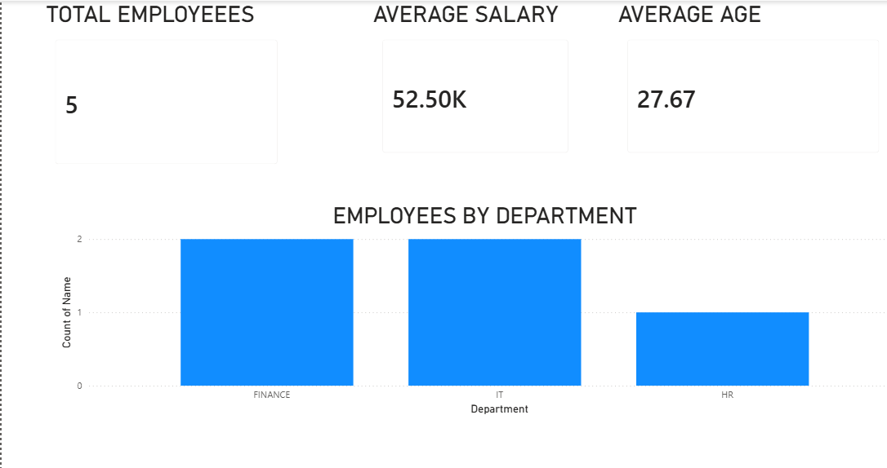

# 📊 Data Cleaning & Reporting Automation

## 📌 Project Overview

This project automates the complete data cleaning and reporting workflow.

The system takes raw data, cleans errors, handles missing values and duplicates, generates reports, and creates interactive dashboards.

---

## 🚀 Features

✅ Data cleaning automation  
✅ Missing value handling  
✅ Duplicate removal  
✅ Data standardization  
✅ Automated Excel reports  
✅ Data visualization  
✅ Power BI dashboard  

---

## 🛠 Technologies Used

- Python
- Pandas
- NumPy
- Excel
- Power BI

---

## 📂 Project Structure
Data-Cleaning-Reporting-Project

│
├── data
│ ├── raw_data.csv
│ └── cleaned_data.csv
│
├── scripts
│ ├── data_cleaning.py
│ └── report_generation.py
│
├── reports
│ ├── report.xlsx
│ └── department_chart.png
│
├── dashboard
│ ├── Data_Cleaning_Dashboard.pbix
│ └── dashboard_screenshot.png
│
├── run_project.bat
├── requirements.txt
└── README.md

---

## ⚙️ How To Run

Install libraries:
pip install -r requirements.txt

Run automation:
run_project.bat

The project will:

1. Clean the raw dataset
2. Create cleaned data
3. Generate reports
4. Create visualizations

---

## 📈 Dashboard Preview

---

## 📊 Output

The project generates:

- Cleaned CSV dataset
- Excel summary report
- Department analysis chart
- Power BI dashboard

---

## 👩‍💻 Author

Elizibeth Gummalla
